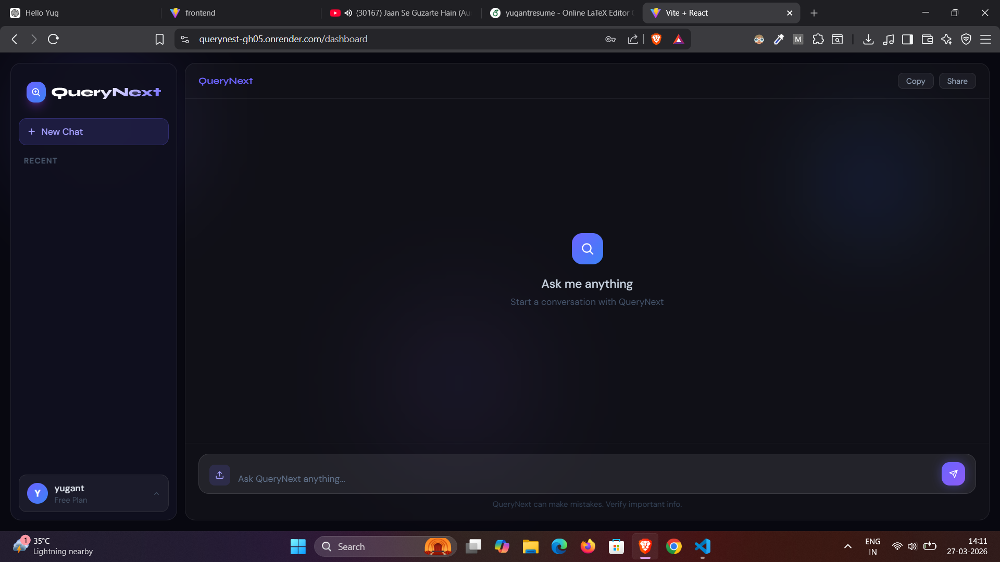
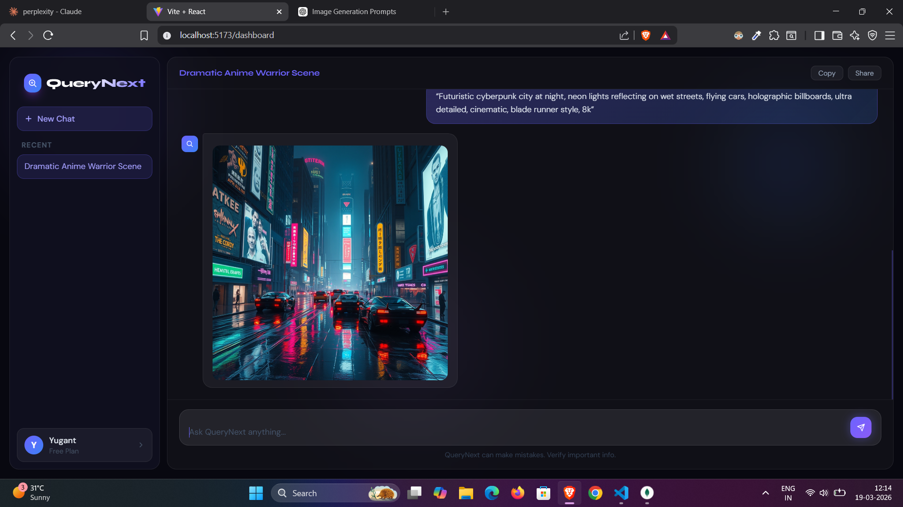

# QueryNext – AI Powered Fullstack Query Generator

QueryNext is a full-stack AI-powered web application that converts natural language into database queries. It helps developers and non-technical users generate optimized queries without deep SQL knowledge.

---

## 🚀 Features

* AI-powered query generation from plain English
* Secure user authentication and session management
* Chat history storage for previously generated queries
* Responsive UI for both desktop and mobile devices
* Clean and modular full-stack architecture

---

## 🛠 Tech Stack

### Frontend

* React / Next.js
* Tailwind CSS

### Backend

* Node.js
* Express.js

### Database

* MongoDB

### AI Integration

* Grok API
* Mistral Api For Title Generate

---

## 🌐 Live Demo - >   https://querynest-gh05.onrender.com/


---

## 📸 Screenshots

*Add screenshots here after capturing UI images*


### Home Page


### AI Query Chat


### Image Generator Page

---

## ⚙️ Installation & Setup

### 1. Clone the Repository

```bash
git clone https://github.com/yugant-singh/QueryNext-Fullstack-Ai-Project.git
cd QueryNext-Fullstack-Ai-Project
```

### 2. Setup Backend

```bash
cd server
npm install
npm run dev
```

### 3. Setup Frontend

```bash
cd client
npm install
npm run dev
```

---

##  Problem Statement

Writing optimized database queries can be difficult and time‑consuming, especially for beginners or non‑technical users. Many developers struggle to quickly translate natural language requirements into correct and efficient database queries.

---

##  Solution

QueryNext solves this problem by using AI to convert natural language input into database queries. Users can describe their data requirements in simple English, and the system generates corresponding queries instantly.

---

##  Future Improvements

* Support for multiple database types (MySQL, PostgreSQL, MongoDB queries)
* Export and save generated queries
* Improved prompt optimization for more accurate results

---

## 👨‍💻 Author

**Yugant Singh**

GitHub: [https://github.com/yugant-singh](https://github.com/yugant-singh)

LinkedIn: [https://www.linkedin.com/in/yugant-singh/]
